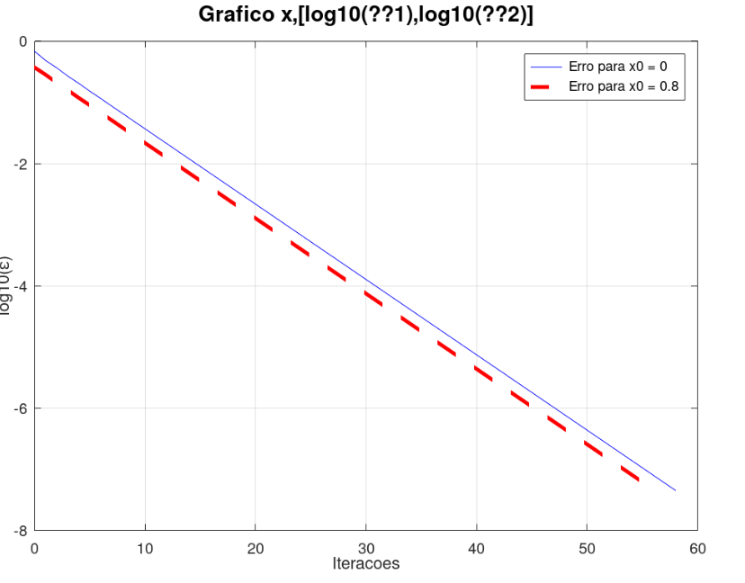

<h1 align="center">
    
</h1>

📌 EfolioA - Computação numerica
------------------

1.2 Script efa20_1.m
Este script foca a visualização gráfica da função g(x) = e−x cos x − 1.1x . Três gráficos são gerados

1.3 Script efa20_2.m
O foco deste script é encontrar soluções da equação g(x)=0 usando o método do ponto fixo para dois valores iniciais distintos, x0=0 e x0=0.8. O erro absoluto é calculado para cada iteração, e o logaritmo base 10 deste erro que é então plotado em função do número de iterações.

🔧 Tecnologias utilizadas:
------------------

- <strong>Octave</strong>
- <strong>MacOS</strong>

💬 Fale comigo
------------------
[*Entre em contato comigo*](https://www.linkedin.com/in/ivo-baptista-3712144/)

